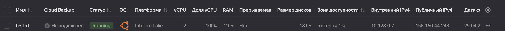
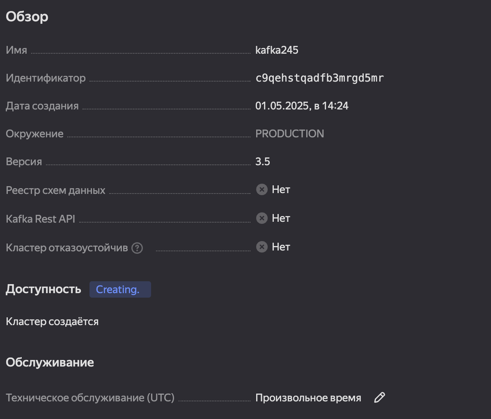
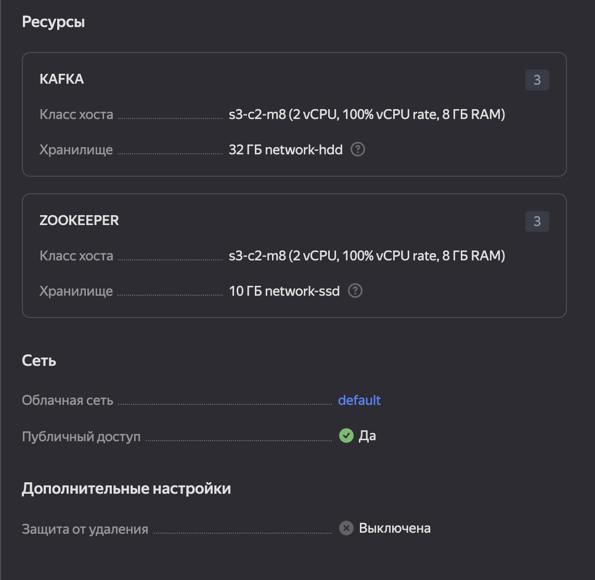
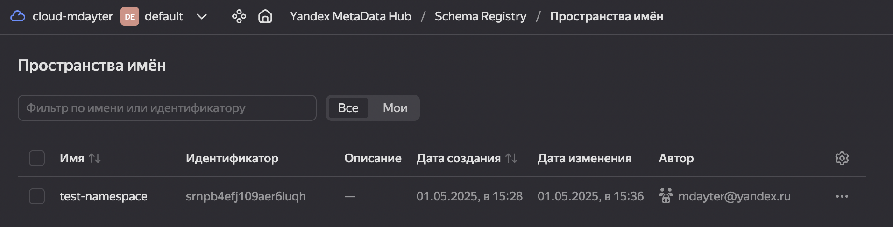

### создание виртуальной машины

создание виртуальной машины выполнялось по инструкции из урока, результат можно увидеть на скрине:  

<!---
можно посмотреть картинку step0.png в директории pics
-->

### создание кластера

создаём кластер через веб-интерфейс. результат можно увидеть на скринах:  

<!---
можно посмотреть картинку step1-part1.png в директории pics
-->

<!---
можно посмотреть картинку step1-part2.png в директории pics
-->

### создание топика

создаём топик через веб-интерфейс. результат можно увидеть на скрине:  

<!---
можно посмотреть картинку step2.png в директории pics
-->

### создание Schema Registry

создаём Schema Registry через веб-интерфейс. результат можно увидеть на скрине:  

<!---
можно посмотреть картинку step3.png в директории pics
-->