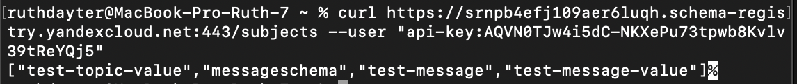
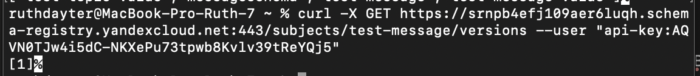

### создание виртуальной машины

создание виртуальной машины выполнялось по инструкции из урока, результат можно увидеть на скрине:  

<!---
можно посмотреть картинку step0.png в директории pics
-->

### создание кластера

создаём кластер через веб-интерфейс. результат можно увидеть на скринах:  

<!---
можно посмотреть картинку step1-part1.png в директории pics
-->

<!---
можно посмотреть картинку step1-part2.png в директории pics
-->

### создание топика

создаём топик через веб-интерфейс. результат можно увидеть на скрине:  

<!---
можно посмотреть картинку step2.png в директории pics
-->

### создание Schema Registry

создаём Schema Registry через веб-интерфейс. результат можно увидеть на скрине:  

<!---
можно посмотреть картинку step-3.png в директории pics
-->

### команды через curl
в нашем случае не имеет смысла кидать команду на localhost, поскольку наша Schema Registery живёт на Yandex Cloud. поэтому команда будет выглядеть по-другому (скрин):

<!---
можно посмотреть картинку step-4-part-1.png в директории pics
-->

то же самое касается и версий (скрин):

<!---
можно посмотреть картинку step-4-part-2.png в директории pics
-->