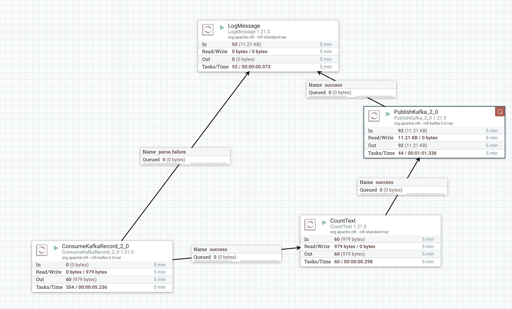
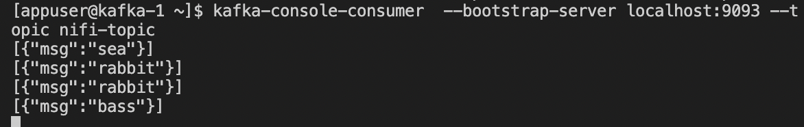

### запуск кластера

команда:  
`docker-compose up -d`

### создание топиков

сначала зайдём в консоль. команда:  
`docker exec -it kafka-1 bash`

команда:

```
kafka-topics --bootstrap-server localhost:9093 --topic nifi-topic --create --partitions 1 --replication-factor 1
```

и для продьюсера. команда:  

```
kafka-topics --bootstrap-server localhost:9093 --topic nifi-raw --create --partitions 1 --replication-factor 1
```

### схема nifi

[](https://github.com/dayterr/kafka-project-5/blob/main/part2/pics/step-1.png)

<!---
можно посмотреть картинку step-0.png в директории pics
-->

1. ConsumeKafkaRecord_2_0 – читает из топика `nifi-raw`
2. CountText – считает некоторую статистику по сообщениям
3. PublishKafka_2_0 – отправляет в топик `nifi-topic`
4. LogMessage – просто пишет логи

### логи

логи через `kafka-console-consumer.sh`. команда:  

```
kafka-console-consumer  --bootstrap-server localhost:9093 --topic nifi-topic
```

[](https://github.com/dayterr/kafka-project-5/blob/main/part2/pics/step-0.png)

<!---
можно посмотреть картинку step-0.png в директории pics
-->

### логи из контейнера nifi, пример

```
2025-05-01 22:39:18 2025-05-01 19:39:17,947 INFO [pool-7-thread-1] o.a.n.c.r.WriteAheadFlowFileRepository Successfully checkpointed FlowFile Repository with 0 records in 12 milliseconds
2025-05-01 22:39:21 2025-05-01 19:39:20,153 INFO [Timer-Driven Process Thread-3] o.a.nifi.processors.standard.LogMessage LogMessage[id=8d100522-0196-1000-ac82-ecb4f4e9be3b] null
2025-05-01 22:39:26 2025-05-01 19:39:25,291 INFO [Timer-Driven Process Thread-4] o.a.nifi.processors.standard.LogMessage LogMessage[id=8d100522-0196-1000-ac82-ecb4f4e9be3b] null
2025-05-01 22:39:31 2025-05-01 19:39:30,369 INFO [Timer-Driven Process Thread-9] o.a.nifi.processors.standard.LogMessage LogMessage[id=8d100522-0196-1000-ac82-ecb4f4e9be3b] null
2025-05-01 22:39:36 2025-05-01 19:39:35,453 INFO [Timer-Driven Process Thread-4] o.a.nifi.processors.standard.LogMessage LogMessage[id=8d100522-0196-1000-ac82-ecb4f4e9be3b] null
2025-05-01 22:39:36 2025-05-01 19:39:35,822 INFO [Write-Ahead Local State Provider Maintenance] org.wali.MinimalLockingWriteAheadLog org.wali.MinimalLockingWriteAheadLog@16b578a3 checkpointed with 4 Records and 0 Swap Files in 19 milliseconds (Stop-the-world time = 9 milliseconds, Clear Edit Logs time = 3 millis), max Transaction ID 12
2025-05-01 22:39:37 2025-05-01 19:39:37,104 INFO [Cleanup Archive for default] o.a.n.c.repository.FileSystemRepository Successfully deleted 0 files (0 bytes) from archive
2025-05-01 22:39:37 2025-05-01 19:39:37,104 INFO [Cleanup Archive for default] o.a.n.c.repository.FileSystemRepository Archive cleanup completed for container default; will now allow writing to this container. Bytes used = 19.92 GB, bytes free = 38.45 GB, capacity = 58.37 GB
2025-05-01 22:39:38 2025-05-01 19:39:37,942 INFO [pool-7-thread-1] o.a.n.c.r.WriteAheadFlowFileRepository Initiating checkpoint of FlowFile Repository
2025-05-01 22:39:38 2025-05-01 19:39:37,946 INFO [pool-7-thread-1] o.a.n.wali.SequentialAccessWriteAheadLog Checkpointed Write-Ahead Log with 0 Records and 0 Swap Files in 3 milliseconds (Stop-the-world time = 2 milliseconds), max Transaction ID 558
2025-05-01 22:39:38 2025-05-01 19:39:37,946 INFO [pool-7-thread-1] o.a.n.c.r.WriteAheadFlowFileRepository Successfully checkpointed FlowFile Repository with 0 records in 3 milliseconds
```